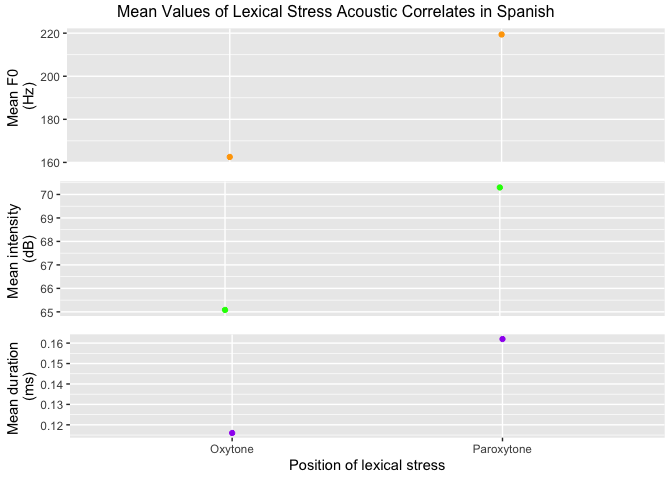

pa2
================

Comparison of lexical stress acoustic correlates in phonemically equally
sounding words in Spanish. Example: “busco - buscó”

| lex\_stress | mean\_Hz | mean\_dB | mean\_ms |
| :---------- | -------: | -------: | -------: |
| oxytone     |  162.532 |   65.082 |    0.116 |
| paroxytone  |  219.386 |   70.298 |    0.162 |

<!-- -->
